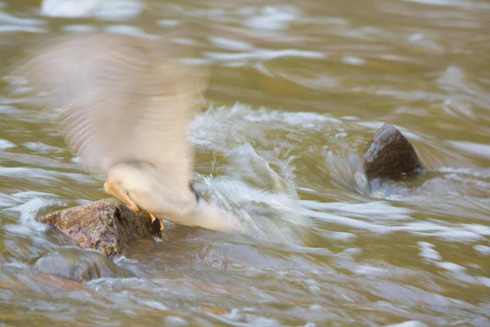

**Announcements**

Here's the complete version of <a href="practice-exam-1-all.pdf">Practice Exam 1</a>.

Upcoming schedule:

* Saturday: Review, 4-7 PM 
* next Tuesday: Exam 1

The <a href="https://www.youtube.com/playlist?list=PLPAgEthTEIuW-5dKeYTktC06sdNGa_xFU">solutions to Homework 1</a> are posted on YouTube.

---

 

 
 
<em>Black-crowned night heron fishing in Rock Creek Park, Washington DC. 1/20 second exposure.</em> 
<em>How fast are the bird's wings moving?</em>
