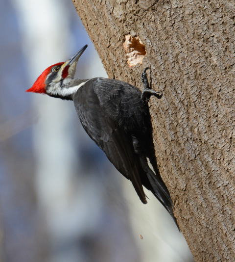

<a href="recitation/recitation-tech-practice.pdf">Tech practice recitation materials</a>   

<a href="slides/lecture16.pdf">The work-energy theorem</a>  

 

Please consult the syllabus addendum, linked above, for a complete description of how things will go after Spring Break.

### Upcoming assignments:

<a href="hw/hw9-2020.pdf">Homework 9 is posted</a> and is due Wednesday, March 25.

### Upcoming help hours:

### Information

- Class meetings: Tuesdays and Thursdays, 9:30-10:50 AM or 11 AM-12:20 PM, Stolkin Auditorium
- Teaching staff:
   - **Professors**:
      * Prof. Matt Rudolph, <msrudolp@syr.edu>, Physics Building room 325
      * Prof. Walter Freeman, <wafreema@syr.edu>, Physics Building room 215
   - **Lead TA**: Merrill Asp, <masp01@syr.edu>
   - **Recitation TA's:**
      * Vidyesh Rao Anisetti, <vvaniset@syr.edu>
      * Soumik Banerjee, <sbaner03@syr.edu>
      * Prashali Chauhan, <prchauha@syr.edu>
      * Kevin Ching, <keching@syr.edu>
      * Mingwei Dai, <mdai07@syr.edu>
      * Kesavan Manivannan, <kmanivan@syr.edu>
      * Mario Olivares, <maolivar@syr.edu>
      * Zhiwen Sun, <zsun31@syr.edu>
   - **Undergraduate coaches:** Too many to list here :)

 
---

 

<!--

 
 
<em>Pileated woodpecker, Glover Park, Washington DC.  
What's special about his tail that lets him keep his balance? 
How did he make that hole in fifteen seconds or so?
</em>

-->

